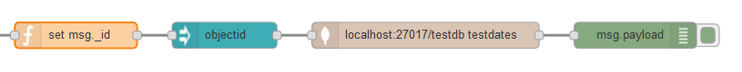

# node-red-contrib-objectid
Node-Red Node to create an ObjectID for queries in mongodb

This small node-red node is used to create an ObjectID for mongodb.

The selected property in `msg` will be enhanced or replaced
with an Object-Id, you can input a 24 char hex and create an Object-Id from it.

For example: `msg.payload._id = "572dbc06f307c8682045c55c"`

If the target property is null, a random id is created.

## Config

## License:
__MIT:__
THE SOFTWARE IS PROVIDED "AS IS", WITHOUT WARRANTY OF ANY KIND, EXPRESS OR IMPLIED, INCLUDING BUT NOT LIMITED TO THE WARRANTIES OF MERCHANTABILITY, FITNESS FOR A PARTICULAR PURPOSE AND NONINFRINGEMENT. IN NO EVENT SHALL THE AUTHORS OR COPYRIGHT HOLDERS BE LIABLE FOR ANY CLAIM, DAMAGES OR OTHER LIABILITY, WHETHER IN AN ACTION OF CONTRACT, TORT OR OTHERWISE, ARISING FROM, OUT OF OR IN CONNECTION WITH THE SOFTWARE OR THE USE OR OTHER DEALINGS IN THE SOFTWARE.
